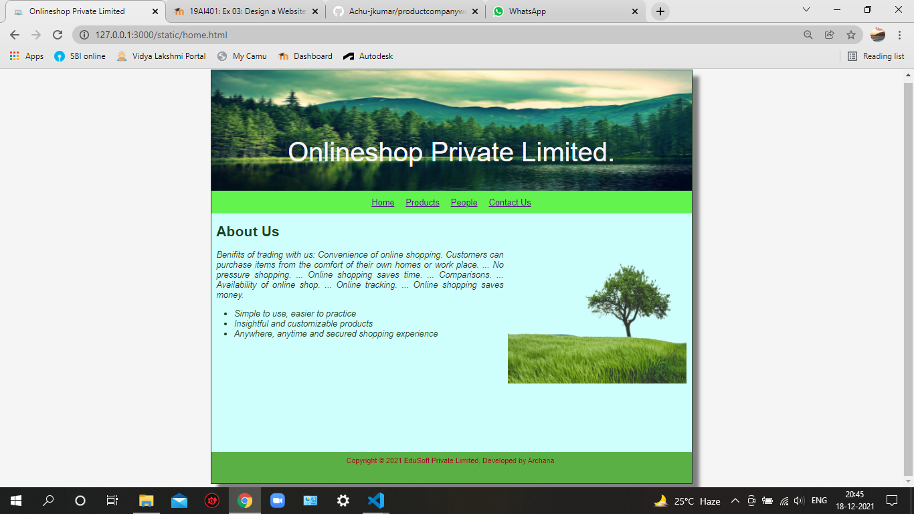
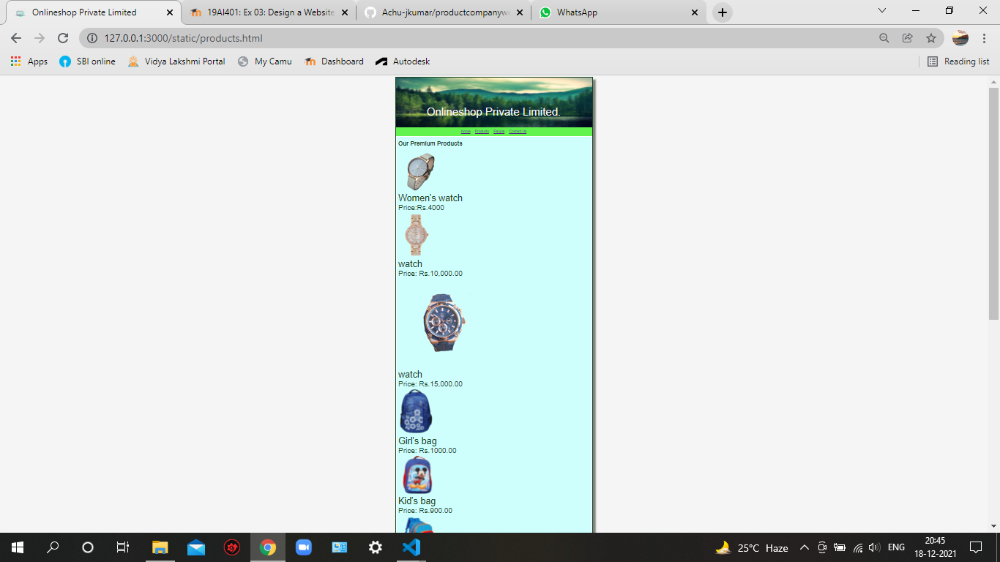
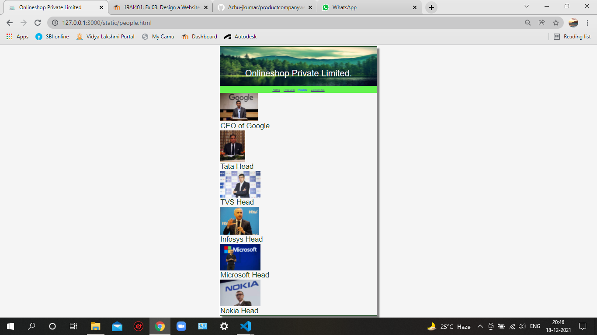
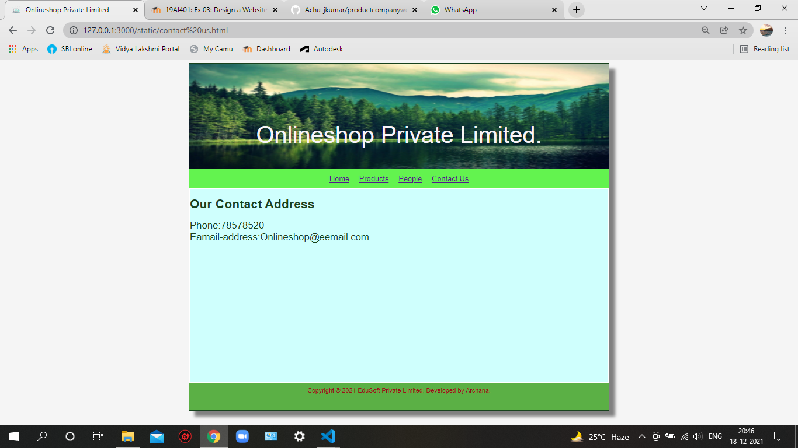

# Web Design for a Software Product Company

## AIM:

To design a static website for a software product company company.

## DESIGN STEPS:

### Step 1:

Requirement collection.

### Step 2:

Creating the layout using HTML and CSS.

### Step 3:

Updating the sample content.

### Step 4:

Choose the appropriate style and color scheme.

### Step 5:

Validate the layout in various browsers.

### Step 6:

Validate the HTML code.

### Step 6:

Publish the website in the given URL.

## PROGRAM :
### Program 1:
```
<!DOCTYPE html>
<html lang="en">
  <head>
    <title>Onlineshop Private Limited</title>
    <link rel="stylesheet" href="./css/layout.css" />
    <link rel="icon" href="./img/logo-removebg-preview.png" type="image/x-logo-removebg-preview" />
  </head>

  <body>
    <div class="container">
      <div class="banner">Onlineshop Private Limited.</div>
      <div class="menu">
        <div class="menuitemselected"><a href="/static/home.html">Home</a></div>
        <div class="menuitem1"><a href="/static/products.html">Products</a></div>  
        <div class="menuitem2"><a href="/static/people.html">People</a></div>
        <div class="menuitem3"><a href="/static/contact us.html">Contact Us</a></div>
      </div>
      <div class="content">
        <div class="homecontent">
          <h1>About Us</h1>
          
          <div class="contenttext">
            Benifits of trading with us:
            Convenience of online shopping. Customers can purchase items from the comfort of their own homes or work place. ...
            No pressure shopping. ...
            Online shopping saves time. ...
            Comparisons. ...
            Availability of online shop. ...
            Online tracking. ...
            Online shopping saves money.
            <ul>
              <li>Simple to use, easier to practice</li>
              <li>Insightful and customizable products</li>
              <li>Anywhere, anytime and secured shopping experience</li>
            </ul>
            
          </div>
        </div>        
    </div>
    <div class="footer">
      Copyright &#169; 2021 EduSoft Private Limited, Developed by Archana.
    </div>
  </div>
</body>
</html>
```
### Program 2:
```<!DOCTYPE html>
<html lang="en">
  <head>
    <title>Onlineshop Private Limited</title>
    <link rel="stylesheet" href="./css/layout.css" />
    <link rel="icon" href="./img/logo-removebg-preview.png" type="image/x-logo-removebg-preview" />
  </head>

  <body>
    <div class="container">
      <div class="banner">Onlineshop Private Limited.</div>
      <div class="menu">
        <div class="menuitemselected"><a href="/static/home.html">Home</a></div>
        <div class="menuitem1"><a href="/static/products.html">Products</a></div>  
        <div class="menuitem2"><a href="/static/people.html">People</a></div>
        <div class="menuitem3"><a href="/static/contact us.html">Contact Us</a></div>
      </div>
      <div class="content">
        <div class="productcontent">    
          <h1>Our Premium Products</h1>
          <div class="productitems">

              <div class="productitem"> 
                  <div class="itemimage">
                  
                  </div>
                  <div class="itemname">Women's watch</div>
                  <div class="itemprice">Price:Rs.4000 </div>
              </div>

              <div class="productitem"> 
                  <div class="itemimage">
                  
                  </div>
                  <div class="itemname">watch</div>
                  <div class="itemprice">Price: Rs.10,000.00 </div>
              </div>

              <div class="productitem"> 
                  <div class="itemimage">
                  
                  </div>
                  <div class="itemname">watch</div>
                  <div class="itemprice">Price: Rs.15,000.00 </div>
              </div>

              <div class="productitem"> 
                <div class="itemimage">
                
                </div>
                <div class="itemname">Girl's bag</div>
                <div class="itemprice">Price: Rs.1000.00 </div>
            </div>

            <div class="productitem"> 
              <div class="itemimage">
              
              </div>
              <div class="itemname">Kid's bag</div>
              <div class="itemprice">Price: Rs.900.00 </div>
          </div>

          <div class="productitem"> 
            <div class="itemimage">
            
            </div>
            <div class="itemname">Kid's bag</div>
            <div class="itemprice">Price: Rs.950.00 </div>
        </div>

        <div class="productitem"> 
          <div class="itemimage">
          
          </div>
          <div class="itemname">Rolling pen</div>
          <div class="itemprice">Price: Rs.500.00 </div>
      </div>

      <div class="productitem"> 
        <div class="itemimage">
        
        </div>
        <div class="itemname">Multicolor pens</div>
        <div class="itemprice">Price: Rs.700.00 </div>
    </div>

    <div class="productitem"> 
      <div class="itemimage">
      
      </div>
      <div class="itemname">Ball Pointed pen</div>
      <div class="itemprice">Price: Rs.200.00 </div>
    </div>

    <div class="productitem"> 
       <div class="itemimage">
       
       </div>
       <div class="itemname">Parker pen</div>
       <div class="itemprice">Price: Rs.2000.00 </div>
    </div>
    <div class="productitem"> 
      <div class="itemimage">
      
    </div>
       <div class="itemname">Ladies' Purse</div>
       <div class="itemprice">Price: Rs.700.00 </div>
    </div>

    <div class="productitem"> 
      <div class="itemimage">
      
    </div>
       <div class="itemname">Multicolor Purses</div>
       <div class="itemprice">Price: Rs.1000.00 </div>
    </div>


  
  


     


          </div>
          </div>        
      </div>
      <div class="footer">
        Copyright &#169; 2021 EduSoft Private Limited, Developed by Archana.
      </div>
    </div>
  </body>
</html>
```
### Program 3:
```
<!DOCTYPE html>
<html lang="en">
  <head>
    <title>Onlineshop Private Limited</title>
    <link rel="stylesheet" href="./css/layout.css" />
    <link rel="icon" href="./img/logo-removebg-preview.png" type="image/x-logo-removebg-preview" />
  </head>

  <body>
    <div class="container">
      <div class="banner">Onlineshop Private Limited.</div>
      <div class="menu">
        <div class="menuitemselected"><a href="/static/home.html">Home</a></div>
        <div class="menuitem1"><a href="/static/products.html">Products</a></div>  
        <div class="menuitem2"><a href ="/static/people.html"></a>People</a></div>
        <div class="menuitem3"><a href="/static/contact us.html">Contact Us</a></div>
      </div>
      <div class="productitem"> 
        <div class="itemimage">
        
      </div>
         <div class="itemname">CEO of Google</div>
      </div>
      <div class="productitem"> 
        <div class="itemimage">
        
      </div>
         <div class="itemname">Tata Head</div>
      </div>
      <div class="productitem"> 
        <div class="itemimage">
        
      </div>
         <div class="itemname">TVS Head</div>
      </div>
      <div class="productitem"> 
        <div class="itemimage">
        
      </div>
         <div class="itemname">Infosys Head</div>
      </div>
      <div class="productitem"> 
        <div class="itemimage">
        
      </div>
         <div class="itemname">Microsoft Head</div>
      </div>
      <div class="productitem"> 
        <div class="itemimage">
        
      </div>
         <div class="itemname">Nokia Head</div>
      </div>
```
### Program 4:
```
<!DOCTYPE html>
<html lang="en">
  <head>
    <title>Onlineshop Private Limited</title>
    <link rel="stylesheet" href="./css/layout.css" />
    <link rel="icon" href="./img/logo-removebg-preview.png" type="image/x-logo-removebg-preview" />
  </head>

  <body>
    <div class="container">
      <div class="banner">Onlineshop Private Limited.</div>
      <div class="menu">
        <div class="menuitemselected"><a href="/static/home.html">Home</a></div>
        <div class="menuitem1"><a href="/static/products.html">Products</a></div>  
        <div class="menuitem2"><a href="/static/people.html">People</a></div>
        <div class="menuitem3"><a href="/static/contact us.html">Contact Us</a></div>
      </div>
      
        <div class="contact content">
           <h1>Our Contact Address</h1>  
        
          <div class="contacttext">
           Phone:78578520
           <br>Eamail-address:Onlineshop@eemail.com
          </div>
        </div>

     
<div class="footer">
  Copyright &#169; 2021 EduSoft Private Limited, Developed by Archana.
</div>
</div>
</body>
</html>
```
### Program of Layout:
```
* {
  box-sizing: border-box;
  font-family: Arial, Helvetica, sans-serif;
}
body {
  background-color: whitesmoke;
  color: #17421d;
}
.container {
  width: 1080px;
  margin-left: auto;
  margin-right: auto;
  border-width: 1px 1px 1px 1px;
  border-style: solid;
  box-shadow: 15px 15px 8px gray;
}

.banner {
  display: block;
  width: 100%;
  height: 270px;
  text-align: center;
  font-size: 60px;
  background-image: url("/static/img/forest.jpg");
  background-size: 100% 100%;
  margin: 0px 0px 0px 0px;
  padding-top: 150px;
  color: #f8f4f8;
}

.menu {
  display: block;
  width: 100%;
  height: 50px;
  font-size: larger;
  background-color: #63f34f;
  text-align: center;
  padding-top: 15px;
  margin: 0px 0px 0px 0px;
  border-width: 1px;
}

.menuitem {
  display: inline-block;
  margin-left: 10px;
  margin-right: 10px;
}
.menuitemselected {
  display: inline-block;
  margin-left: 10px;
  margin-right: 10px;
  color: #16d1ae;
}

.menuitem a {
  text-decoration: none;
  color:#0faa24;
}

.content {
  display: block;
  width: 100%;
  background-color: #cffffd;
  min-height: 500px;
  margin: 0px 0px 0px 0px;
  border-width: 1px;
  border-color: white;
  border-style: solid;
}
.homecontent {
  min-height: 500px;
  margin: 10px 10px 10px 10px;
}
.homecontent h1 {
  text-align: left;
}
.homecontent img {
  float: right;
  width: 400px;
  height: 300px;
  margin-left: 10px;
}

.contenttext {
  text-align: justify;
  font-style:italic;
  font-size: larger;
}

.productcontent {
  min-height: 500px;
  margin: 10px 10px 10px 10px;
}

.productcontent h1 {
  text-align: left;
}
.productitem1 {
  display: block;
  margin-left: auto;
  margin-right: auto;
  width: 100px;
  margin-bottom: 5px;
}
.procontenttext{
  text-align: justify;
  font-style:italic;
  font-size: larger;
}
.itemname{
  display: block;
  font-size: 50px;
}
.itemprice{
  display: block;
  font-size: 40px;
}
.contact content{
  display: block;
  width: 100%;
  background-color: #cffffd;
  min-height: 500px;
  margin: 0px 0px 0px 0px;
  border-width: 1px;
  border-color: white;
  border-style: solid;
  
}

.contactus content h1 {
  text-align: left;
}
.contacttext{
  text-align: justify;
  font-style: normal;
  font-size: 25px;

}
.content3{
  display: block;
  width: 100%;
  background-color: #cffffd;
  min-height: 500px;
  margin: 0px 0px 0px 0px;
  border-width: 1px;
  border-color: white;
  border-style: solid;
}
.menuitem1{
  display: inline-block;
  margin-left: 10px;
  margin-right: 10px;
  color:red;
}
.menuitem2{
  
  display: inline-block;
  margin-left: 10px;
  margin-right: 10px;
  color:blue;
}
.menuitem3{
  display: inline-block;
  margin-left: 10px;
  margin-right: 10px;
  color: yellow;
}
.contactcontent{
  text-align: left;
}


.footer {
  display: block;
  width: 100%;
  height: 70px;
  background-color: #5bb045;
  text-align: center;
  padding-top: 10px;
  margin: 0px 0px 0px 0px;
  color: #9c1018;
}
```


## OUTPUT:

### Home Page:



### Product Page:



### People Page:


### Contact Page:



## Result:

Thus a website is designed for the software product company and the HTML,CSS code are validated.
